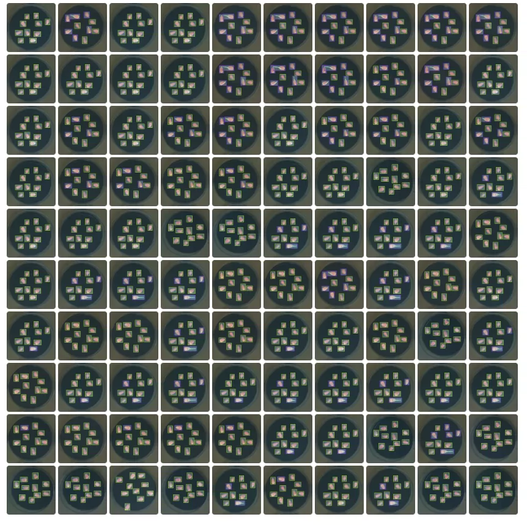
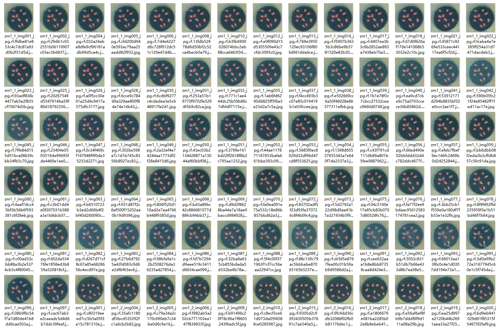
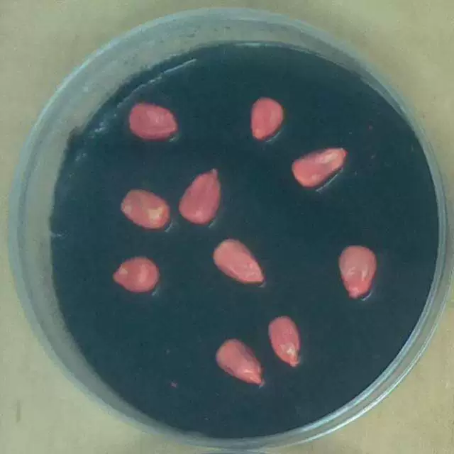
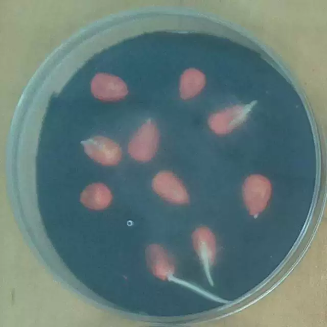
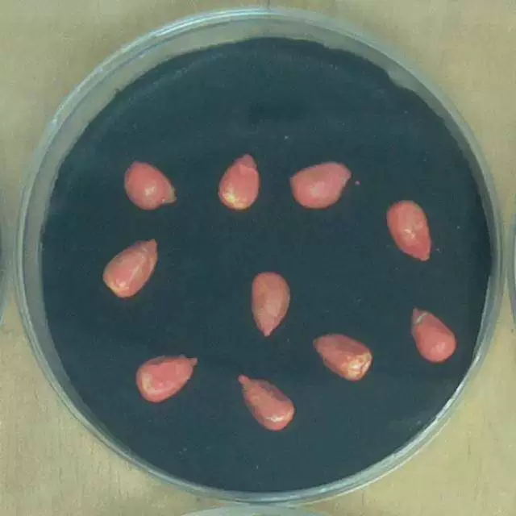
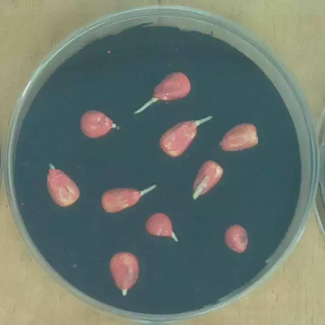

## Body

Corn Seed Germination Detection Dataset in YOLO format

A total of 8148 images are available, labeled and divided into training set, test set, and validation set.

The dataset is divided into two categories: 'Germinated' and 'Non-Germinated'.
"Germinated" and "Non-Germinated"

Electronic virtual products sold are not returnable.

## Images

Here is a pay link on Stripe ( https://buy.stripe.com/3cs8yP7sY87d0vu9AB ). Please contact me lonlonago@foxmail.com after funding $89, and I will send you a complete data files , thank you!

